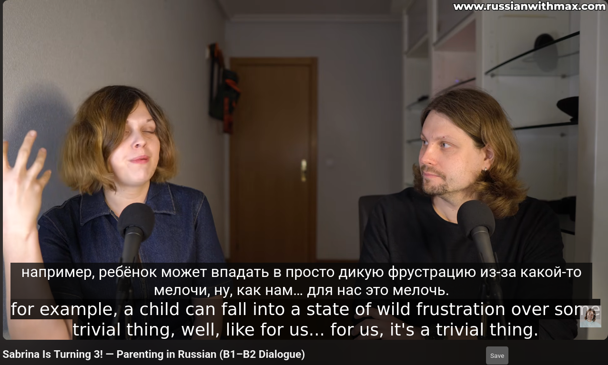

# Youtube Dual Subtitles

- A simple UserScript to add a secondary subtitle to YouTube (Install with Tampermonkey on Firefox or Greasemonkey on Chrome)
- Secondary subtitle language selection via dropdown inside YouTube menu
- You can change the DEFAULT_LANG and FALLBACK_LANG variables to set default languages

## Todo:
1. Add support for machine translated subtitles
2. Add box / popup to display error messages. Please look into the console for now
3. (QOL) Draggable subtitle, use same style as YT subtitle or adding option to style secondary subtitle